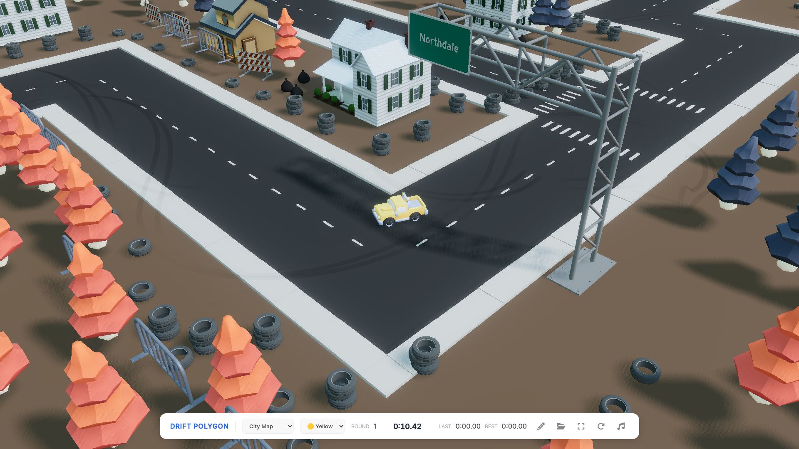

# Drift Polygon

A 3D web-based racing and drifting game built with JavaScript, Three.js, and the CrashCat physics engine. 

[**🏎️ Play the Game**](https://hra.dobrodruzi.cz/drift/) · [**📁 GitHub Repository**](https://github.com/agp-l/drift)

*(Note: Replace `screenshot.png` with an actual image of the gameplay)*

## About the Project
Drift Polygon is an enhanced adaptation of the original Starter Kit Racing concept. It features fully functioning 3D physics, dynamic tire marks, particle effects, lap timing systems, background music, and a track editor.

## File Structure & Architecture

The game is modular, separating physics, rendering, audio, and game logic into distinct files.

### 🎮 Core Engine
* **`main.js`**: The central brain of the game. It initializes the Three.js scene, camera, and the WebGL renderer. It constructs the physics `world` using the *crashcat* engine and sets up the main `animate()` render loop. Inside the render loop, it calculates delta time (`dt`), synchronizes the visual meshes with the physical rigid bodies (like tires and the vehicle), updates particles, handles collision events via `contactListener`, and manages camera tracking. 
* **`index.html`**: The main entry point. It contains the game canvas and the overlay UI (start button, lap counter, vehicle selector, fullscreen toggle, reset, and music controls).
* **`editor.html`**: A separate interface for building and modifying custom track layouts.

### 🚗 Vehicle & Physics
* **`Vehicle.js`**: Contains the logic for the car. Manages acceleration, braking, steering input, and drift intensity calculations.
* **`Physics.js`**: Handles the creation of rigid bodies and colliders (like the track walls and the car's bounding box) to interact with the *crashcat* physics engine.

### 🏁 Gameplay & Environment
* **`Track.js`**: Responsible for decoding track data, building the visual 3D track from modular cell parts, and computing boundaries/spawn positions.
* **`Controls.js`**: Captures and normalizes player input from the keyboard (WASD/Arrows) and touch devices.
* **`LapTimer.js`**: Tracks the player's position against the start/finish line. It prevents "zero-second" lap exploits on the first pass, records lap times, and stores the best times using the browser's Local Storage.

### 💥 Visuals & Audio
* **`Particles.js`**: Generates and animates the smoke trails when the vehicle is drifting.
* **`DriftMarks.js`**: Dynamically creates tire skid marks on the road surface based on the car's slip angle.
* **`Audio.js`**: Manages the Web Audio API context. It handles the dynamic pitch of the engine based on speed/gears, the squeal of tires during drifts, impact sounds upon collision, and the background music loop.

## Credits

- **Game Assets:** [Kenney](https://kenney.nl/) (CC0)
- **Physics Engine:** [crashcat](https://github.com/isaac-mason/crashcat) by Isaac Mason
- **Original JS Port:** [mrdoob](https://github.com/mrdoob/Starter-Kit-Racing) (Ported to JavaScript with Claude)
- **Drift Polygon Enhancements:** Custom UI, audio systems, and physics tweaks by [agp-l](https://github.com/agp-l).